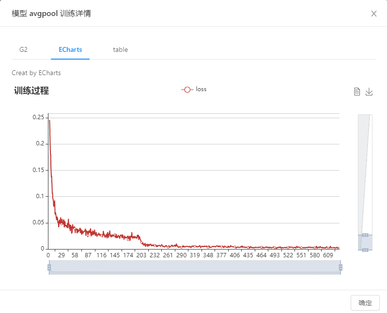
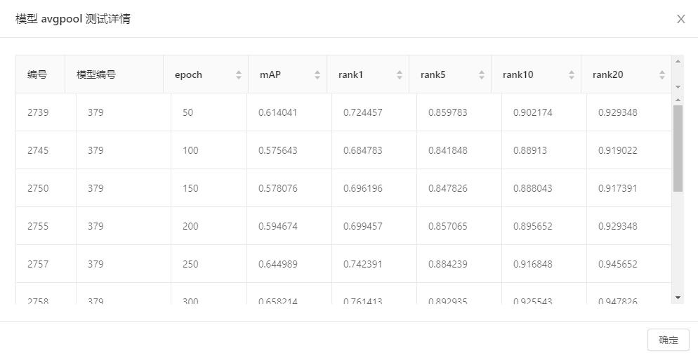

# Web
Vehicle/Person Re-identification 

车辆/行人重识别在线显示系统。

基础架构基于angular、NG-ZORRO、Ng-Alain编写而成。

初始化需指定 src/environments/ SERVER_URL

### 初始化

#### 1、指定服务端端口

 src/environments/environment.ts

#### 2、指定具体服务接口

src/app/shared/api.ts

运行结果图

